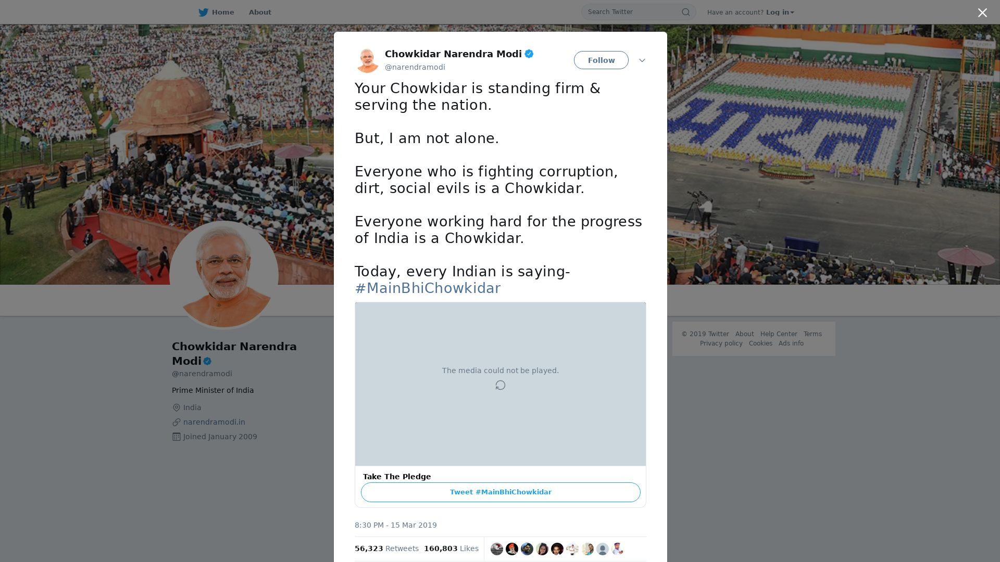

# Part 2

All data scraped using instagram-scraper, documentation for which is available here: https://github.com/fireballpoint1/instagram-scraper

Data Collected: 
- incindia/incindia.json
- bj4india/bjp4india.json
- explore_feed.json

Commands:
```
instagram-scraper bjp4india -m 3 --media-metadata --include-location --media-types none

instagram-scraper -u username -p password --followings-input -d explore_feed1.json -m 1 --media-metadata --include-location --media-types none
```


```python
import json
with open('incindia/incindia.json') as json_file:  
    data = json.load(json_file)

# print(data)
```


```python
# for i in data['GraphImages']:
#     print(i)
    
# likes=data[0]
# print(likes)
# ID=data['GraphImages']['shortcode']
like_data=[]
for i in data['GraphImages']:
    #     if(i['edge_media_preview_like']['count']>likes):
    likes=i['edge_media_preview_like']['count']
    ID=i['shortcode']
    like_data.append({'shortcode':ID,'likes':likes})
# print("likes =",likes,"ID =",ID)
# print(like_data)
sorted_like_data=sorted(like_data, key = lambda i: i['likes'],reverse=True)
# print(sorted_like_data)
```


```python
from urllib.parse import urlencode
from urllib.request import urlretrieve
from IPython.display import Image

def get_screenshot(ID,name):
    params = urlencode(dict(access_key="ed9b4d00816249878adf785744b55465",
                        url='https://www.instagram.com/p/' + str(ID)))
    urlretrieve("https://api.apiflash.com/v1/urltoimage?" + params, name)
    
```

# 2.1.a. Which post has the most likes, and which has the most comments? Retrieve it's IDs and post a screenshot of the post in the final report.


```python
get_screenshot(sorted_like_data[0]['shortcode'],"most_liked_inc.jpeg")
Image(filename="most_liked_inc.jpeg") 
```


```python
pop_data=[]
for i in data['GraphImages']:
    #     if(i['edge_media_preview_like']['count']>likes):
    likes=i['edge_media_preview_like']['count']
    comments=i['edge_media_to_comment']['count']
    #views=i['edge_media_preview_like']['count']
    popu=likes+comments
    ID=i['shortcode']
    pop_data.append({'shortcode':ID,'popu':popu})
# print("likes =",likes,"ID =",ID)
# print(like_data)
sorted_pop_data=sorted(pop_data, key = lambda i: i['popu'],reverse=True)
# print(sorted_pop_data)
```

# 2.1.b. Show the top 5 most popular posts on the report. Devise your own algorithm to calculate popularity based on likes, comments, views or any other metric.


```python
get_screenshot(sorted_pop_data[0]['shortcode'],"most_popu_inc.jpeg")
Image(filename="most_popu_inc.jpeg") 
```


```python
get_screenshot(sorted_pop_data[1]['shortcode'],"most_popu1_inc.jpeg")
Image(filename="most_popu1_inc.jpeg") 
```


```python
get_screenshot(sorted_pop_data[2]['shortcode'],"most_popu_inc2.jpeg")
Image(filename="most_popu_inc2.jpeg") 
```





```python
get_screenshot(sorted_pop_data[3]['shortcode'],"most_popu_inc3.jpeg")
Image(filename="most_popu_inc3.jpeg") 
```


```python
get_screenshot(sorted_pop_data[4]['shortcode'],"most_popu_inc4.jpeg")
Image(filename="most_popu_inc4.jpeg") 
```


# 2.1.c List down the top 5 most used hashtags by the INC's official handle.


```python
import operator
hashtags={}
for i in data['GraphImages']:
    #     for j in i:
    #         print(j)
    #for tags in i:
    #print(i['tags'])
    #     i['tags']
    try:
        for j in i['tags']:
            if(j in hashtags):
                hashtags[j]=hashtags[j]+1
            else:
                hashtags[j]=1
    except:
        continue
print("Most used hashtag by Congress on insta:")
# print(sorted(hashtags.items(), key=operator.itemgetter(1))[0])
sorted_hashtags=sorted(hashtags.items(), key=lambda kv: kv[1],reverse=True)
for i in range(5):
    print(i+1,sorted_hashtags[i][0])
```

    Most used hashtag by Congress on insta:
    1 Congress
    2 India
    3 NoMo
    4 BJP
    5 RahulGandhi


```python
with open('bjp4india/bjp4india.json') as json_file:  
    bjp_data = json.load(json_file)

# print(bjp_data)
```


```python
total=0
video=0
for i in bjp_data['GraphImages']:
    if i['__typename']=='GraphVideo':
        video+=1
    total+=1
print(total,video)
```

    500 316


# 2.2.a How many posts consist of videos? Plot a pie chart representing the share of images in the tweets as compared to videos.


```python
import numpy as np
%matplotlib inline
import matplotlib.pyplot as plt
labels = 'Posts with Videos', 'Others'
sizes = [video,total-video]
colors = ['gold','lightskyblue']
explode = (0.1, 0,)  # explode 1st slice
 
# Plot
plt.pie(sizes, explode=explode, labels=labels, colors=colors,
autopct='%1.1f%%', shadow=True, startangle=140)
 
plt.axis('equal')
plt.show()
```


```python
pop_data=[]
for i in bjp_data['GraphImages']:
    #     if(i['edge_media_preview_like']['count']>likes):
    likes=i['edge_media_preview_like']['count']
    comments=i['edge_media_to_comment']['count']
    #views=i['edge_media_preview_like']['count']
    try:
        text=i['edge_media_to_caption']['edges'][0]['node']['text']
    except:
        continue
    #print(text)
    popu=likes+comments
    ID=i['shortcode']
    pop_data.append({'shortcode':ID,'popu':popu,'text':text})
# print("likes =",likes,"ID =",ID)
# print(like_data)
sorted_pop_data=sorted(pop_data, key = lambda i: i['popu'],reverse=True)
# print(sorted_pop_data)
```


```python
from wordcloud import WordCloud, STOPWORDS, ImageColorGenerator

comment_words=""
stopwords = set(STOPWORDS) 
for i in sorted_pop_data[:200]: 
    #print(i['popu'])   
    val=i['text']
    
    # split the value 
    tokens = val.split() 

    # Converts each token into lowercase 
    for i in range(len(tokens)): 
        comment_words = comment_words+tokens[i].lower()+" "
```

# 2.2.b Using the same algorithm devised earlier to calculate popularity, plot a word cloud of the top 200 most popular posts' descriptions. Which words occur most frequently and why?


```python
wordcloud = WordCloud(width = 800, height = 800, 
                background_color ='white', 
                stopwords = stopwords, 
                min_font_size = 10).generate(comment_words) 
  
# plot the WordCloud image                        
# plt.figure(figsize = (8, 8), facecolor = None) 
plt.imshow(wordcloud) 
plt.axis("off") 
plt.tight_layout(pad = 0) 
  
plt.show() 
```


```python
with open('explore_feed.json') as json_file:  
    explore_data = json.load(json_file)

# print(explore_data)
```


```python
print(len(explore_data['GraphImages']))
```

    12827


```python
explore_pop_data=[]
for i in explore_data['GraphImages']:
    #     if(i['edge_media_preview_like']['count']>likes):
    likes=i['edge_media_preview_like']['count']
    comments=i['edge_media_to_comment']['count']
    #print(text)
    popu=likes+comments
    ID=i['shortcode']
    explore_pop_data.append({'shortcode':ID,'popu':popu,'text':text})
# print("likes =",likes,"ID =",ID)
# print(like_data)
sorted_explore_pop_data=sorted(explore_pop_data, key = lambda i: i['popu'],reverse=True)
```

# 2.3.a Which are the top 5 most popular posts? Post screenshots of the posts in your report


```python
get_screenshot(sorted_explore_pop_data[0]['shortcode'],"most_popu_explore.jpeg")
Image(filename="most_popu_explore.jpeg") 
```


```python
get_screenshot(sorted_explore_pop_data[1]['shortcode'],"most_popu_explore1.jpeg")
Image(filename="most_popu_explore1.jpeg") 
```


```python
get_screenshot(sorted_explore_pop_data[2]['shortcode'],"most_popu_explore2.jpeg")
Image(filename="most_popu_explore2.jpeg") 
```


```python
get_screenshot(sorted_explore_pop_data[3]['shortcode'],"most_popu_explore3.jpeg")
Image(filename="most_popu_explore3.jpeg") 
```


```python
get_screenshot(sorted_explore_pop_data[4]['shortcode'],"most_popu_explore4.jpeg")
Image(filename="most_popu_explore4.jpeg") 
```


```python
total=len(explore_data['GraphImages'])
multiple_count=0
for i in explore_data['GraphImages']:
    if(len(i['urls'])>1):
        multiple_count+=1
print(multiple_count,total)
```

    622 12827


# 2.3.b Plot a pie chart comparing number of posts with just a single image/video in it, and number of posts with multiple images/videos in it.


```python
labels = 'Posts with multiple images/videos', 'Others'
sizes = [multiple_count,total-multiple_count]
colors = ['gold','lightskyblue']
explode = (0.1, 0,)  # explode 1st slice
 
# Plot
plt.pie(sizes, explode=explode, labels=labels, colors=colors,
autopct='%1.1f%%', shadow=True, startangle=140)
 
plt.axis('equal')
plt.show()
```


